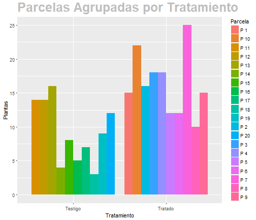

## Tabla en Lenguaje de Marcadores

 

  **Pruebas PISA 2012**   
  

 

| PROMEDIO PRUEBAS PISA 2012 	| Matemáticas 	| Lectura 	| Ciencias 	|
|:----------------:	|:-----------:	|--------:	|----------	|
| Chile 	| 423 	| 441 	| 445 	|
| México 	| 413 	| 424 	| 415 	|
| Colombia 	| 376 	| 403 	| 399 	|

Fuente: OCDE 2013 

--- 

## Imagen Estática    

**Notre Dame Cathedral**
  

---  plot #ggplot2

## Gráfico construido con ggplot2    

 

---

## 
 FINAL DE LA PRESENTACIÓN 

